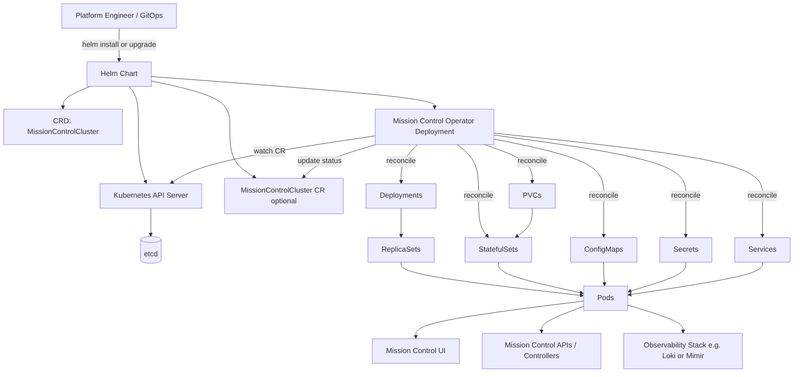

# MissionControlCluster Deployment Structure

This map starts from Helm, then follows how a `MissionControlCluster` custom resource drives Kubernetes resources (Deployments, ConfigMaps, Secrets, Services, and optional stateful parts) through an operator reconciliation loop.

## Glossary (quick reference)

| Resource | What it is | Why it matters in Mission Control |
| --- | --- | --- |
| `CRD` (CustomResourceDefinition) | Adds a new Kubernetes API type (`kind`) with schema and validation. | Defines the `MissionControlCluster` type in the cluster API. |
| `CR` (Custom Resource) | One concrete object/instance of a CRD. | Your `MissionControlCluster` YAML is the desired state the operator watches. |
| `Deployment` | Declarative controller for stateless Pods and rolling updates. | Runs core stateless Mission Control components and handles rollout/self-healing via ReplicaSets. |
| `ReplicaSet` | Keeps a target number of identical Pods running. | Backing controller used by Deployments to maintain replica count. |
| `StatefulSet` | Controller for stateful Pods with stable identity and ordered rollout. | Used for stateful dependencies that need stable naming/storage behavior. |
| `ConfigMap` | Non-sensitive key/value configuration data. | Provides runtime settings to Mission Control Pods (`env` or mounted files). |
| `Secret` | Sensitive configuration data (tokens, passwords, certs). | Injects credentials/certs securely into Mission Control Pods. |
| `Service` | Stable virtual IP and DNS name in front of Pods. | Gives stable internal connectivity even as Pods are replaced. |
| `PVC` (PersistentVolumeClaim) | Request for persistent storage. | Keeps stateful data across Pod restarts and rescheduling. |

## Mission Control components and responsibilities

- **Helm chart**
  - Packages Mission Control resources.
  - Renders templates from values files and submits manifests to Kubernetes.
  - Commonly installs CRDs, operator Deployment, and baseline resources.

- **CRD (`MissionControlCluster`)**
  - Extends Kubernetes API with the `MissionControlCluster` kind.
  - Defines schema and validation for Mission Control desired state.

- **CR (`MissionControlCluster` object)**
  - Concrete instance of desired platform state.
  - Input to operator reconciliation.

- **Mission Control operator**
  - Watches `MissionControlCluster` objects.
  - Creates and updates underlying Kubernetes resources to match desired state.
  - Writes health and readiness to CR status.

- **Deployment and ReplicaSet**
  - Deployment manages stateless workloads and rolling updates.
  - ReplicaSet enforces desired Pod replica count for each Deployment revision.

- **StatefulSet**
  - Manages workloads that need stable identity and ordered rollout.
  - Usually paired with PVCs for persistent data.

- **ConfigMap and Secret**
  - ConfigMap stores non-sensitive configuration.
  - Secret stores sensitive configuration (credentials, tokens, certificates).
  - Both are injected into Pods through env vars or mounted files.

- **Service**
  - Provides stable DNS name and virtual IP in front of dynamic Pods.
  - Enables reliable in-cluster communication and optional external exposure via Ingress/Gateway.

- **PVC (PersistentVolumeClaim)**
  - Requests durable storage from the cluster storage class.
  - Preserves state across Pod restarts and rescheduling.

## 1) Start with Helm (install/upgrade entrypoint)

Helm is a packaging and templating layer on top of Kubernetes APIs:

1. You run `helm install` or `helm upgrade` with a chart and values (`values.yaml`, `--set`, env-specific values files).
2. Helm renders templates into plain Kubernetes manifests (YAML).
3. Those rendered manifests are sent to the Kubernetes API server.
4. In a Mission Control setup, Helm usually installs:
   - The `MissionControlCluster` CRD
   - The Mission Control operator/controller
   - Optionally a default `MissionControlCluster` custom resource
5. After install/upgrade, normal reconciliation continues: operator watches CR and manages Deployments/ConfigMaps/Secrets/Services/PVCs.

In short: **Helm performs install/upgrade rendering and delivery; controllers perform ongoing reconciliation**.

## 2) Core flow with MissionControlCluster after Helm apply

1. The API server stores desired state in `etcd`.
2. The Mission Control operator watches `MissionControlCluster` resources and reconciles desired state.
3. The operator creates/updates native Kubernetes resources, typically:
   - Deployments/ReplicaSets/Pods for stateless components
   - ConfigMaps and Secrets for runtime configuration
   - Services for stable networking
   - Optional StatefulSets/PVCs for stateful dependencies
4. Built-in controllers then take over:
   - Deployment controller -> ReplicaSet -> Pods
   - Scheduler places Pods on Nodes
   - Kubelet starts containers on each Node
5. Services, Ingress/Gateway, and DNS expose cluster capabilities internally or externally.

## 3) ConfigMaps and Secrets in MissionControlCluster

- **ConfigMap** stores non-sensitive configuration (feature flags, URLs, app settings).
- **Secret** stores sensitive values (tokens, passwords, certificates).
- Operator-managed Pods consume them as:
  - Environment variables (`env`, `envFrom`)
  - Mounted files (volumes)
- When the `MissionControlCluster` spec changes, the operator may regenerate/update these objects.
- Updating a ConfigMap/Secret does not always restart Pods automatically. Common patterns:
  - Rollout restart (`kubectl rollout restart deployment/<name>`)
  - Annotation hash pattern in Deployment template to trigger a new rollout

## 4) Supporting resources around MissionControlCluster

- **Namespace**: logical isolation boundary.
- **ServiceAccount + RBAC**: identity and permissions for operator and workload Pods.
- **Service**: stable virtual IP/DNS over changing Pods.
- **Ingress / Gateway**: HTTP(S) entrypoint and routing.
- **PersistentVolumeClaim (PVC)**: durable storage for stateful Mission Control dependencies.
- **HorizontalPodAutoscaler (HPA)**: scales replicas based on metrics.
- **PodDisruptionBudget (PDB)**: limits voluntary disruptions.
- **NetworkPolicy**: restricts pod-to-pod/network traffic.

## 5) End-to-end map (MissionControlCluster + Helm)

## 6) Helm release lifecycle (practical view)

- `helm install`: first-time release creation (CRDs/operator/CR if chart includes them).
- `helm upgrade`: updates rendered manifests and applies changes safely.
- `helm rollback`: re-applies manifests from a previous release revision.
- `helm uninstall`: removes release-managed resources (CRDs may be kept depending on chart design).
- With GitOps, Helm is often executed by Argo CD/Flux controllers instead of humans directly.

## 7) Mental model for MissionControlCluster

`MissionControlCluster` uses Kubernetes as a **declarative control loop system**:
- You declare desired state.
- Controllers continuously compare desired vs actual state.
- They create/update/delete resources until the cluster converges.

The key idea is that you manage one high-level resource (`MissionControlCluster`), while the operator manages the low-level Kubernetes objects needed to realize it.
