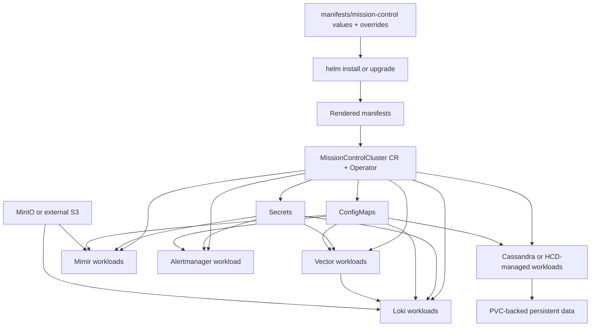

# MissionControlCluster Components and YAML Wiring

This page explains what is typically inside a Mission Control + HCD install (for example Cassandra, Loki, Mimir, Alertmanager) and how those components are wired from YAML configuration into running Kubernetes resources.

## What is actually configured in `/home/michel.deru/Projects/mc-colima/mc-values.yaml`

From that file specifically:

- **Enabled**
  - `ui.enabled: true`
  - `dex` configured and enabled (HTTPS, config secret reference)
  - `aggregator.enabled: true` (Vector aggregator role)
  - `loki.enabled: true` (scalable mode, TLS, S3/object storage config)
  - `mimir.enabled: true` (with internal components, including alertmanager/ruler/distributor/etc.)
  - Embedded `mimir.minio` configured (object storage path for metrics/log stack)
  - `k8ssandra-operator` components present (path to HCD/Cassandra lifecycle integration)

- **Disabled**
  - `agent.enabled: false` (Vector agent role disabled in this values file)
  - `grafana.enabled: false`
  - `ingress.enabled: false`
  - `kubernetes-ingress.enabled: false`

- **Important scope note**
  - This values file configures the Mission Control platform and observability stack.
  - It does **not** itself define a concrete Cassandra datacenter topology; Cassandra/HCD data-plane clusters are typically created later via Mission Control/HCD custom resources.

## What is in the stack

Common component groups:

- Mission Control control-plane services (API, UI, operators/controllers)
- Data-plane database services:
  - **HCD (Hyper-Converged Database)**, which is the enterprise Cassandra distribution
  - Stateful database nodes and supporting resources managed through Mission Control/K8ssandra operators
- Identity/auth (often Dex in local setups)
- Observability stack:
  - **Vector** (collection/forwarding pipeline for logs and telemetry)
  - **Loki** (logs)
  - **Mimir** (metrics)
  - **Alertmanager** (alert routing and notification policy)
- Storage backends:
  - Object storage (embedded MinIO in local labs, external S3 in real envs)
  - PVC-backed storage where required

## How YAML wiring works (end-to-end)

You usually have two YAML layers:

1. **Helm values** (`manifests/mission-control/values.yaml` + `manifests/mission-control/overrides.yaml`)
2. **MissionControlCluster CR** (either installed by chart or applied separately)

Flow:

1. Helm renders chart templates using values files.
2. Rendered manifests create/update CRDs, operator, and related resources.
3. A `MissionControlCluster` CR defines desired platform state.
4. Operator reads the CR and reconciles Deployments/StatefulSets/ConfigMaps/Secrets/Services/PVCs.
5. Components (Loki/Mimir/Alertmanager/etc.) start with config injected from ConfigMaps/Secrets.
6. HCD/Cassandra data-plane resources are reconciled as stateful workloads and wired to storage/network policies.

## Component-to-YAML wiring map

- **Loki**
  - Usually receives data from Vector pipeline components.
  - Wired from Helm values under Loki settings (storage, schema, retention, replicas).
  - Often references object storage endpoint and credentials via Secrets.
  - Usually materializes as Deployments/StatefulSets + Services + ConfigMaps/Secrets.

- **Mimir**
  - Wired from values for storage backend, ingestion/query settings, and scaling.
  - Uses object storage config (endpoint, bucket, access keys) and optional persistence.
  - Materializes into Kubernetes workloads plus required config/secret objects.

- **Alertmanager**
  - Wired from values for routes/receivers and integration config.
  - Notification credentials (webhooks, tokens, SMTP auth, etc.) should come from Secrets.
  - Materializes as workload + Service + config objects.

- **Vector**
  - Wired from values that define sources, transforms, sinks, and buffering behavior.
  - In this file, **aggregator mode is enabled** and **agent mode is disabled**.
  - Config sends logs to Loki and metrics to Mimir (`prometheus_remote_write`), with TLS secrets mounted.
  - Materializes as workload + ConfigMaps/Secrets (agent/aggregator depending on mode).

- **MinIO / S3 wiring**
  - In local labs, values may enable embedded MinIO.
  - This file configures embedded MinIO under `mimir.minio`.
  - Loki/Mimir then point to object storage and read credentials from Secrets.
  - In shared/prod envs, values typically switch to external S3-compatible storage.

- **HCD (enterprise Cassandra) wiring**
  - Wired from HCD/Cassandra-related values and custom resources defining topology, storage, and sizing.
  - Materializes as stateful database workloads (typically StatefulSets via operators), Services, PVCs, and config/secret resources.
  - Node placement, replication, and persistence are driven by CR spec and storage settings.

## Practical wiring example (conceptual)

## Reading any environment quickly

When you inspect a new setup, trace in this order:

1. `manifests/mission-control/overrides.yaml` for environment-specific toggles.
2. `manifests/mission-control/values.yaml` (or chart defaults) for base behavior.
3. `MissionControlCluster` CR spec for desired state at runtime.
4. Generated ConfigMaps/Secrets for effective component config.
5. Resulting Deployments/StatefulSets/Pods/Services for actual runtime state.
6. Stateful data-plane checks: Cassandra/HCD pod health, PVC binding, and service connectivity.
